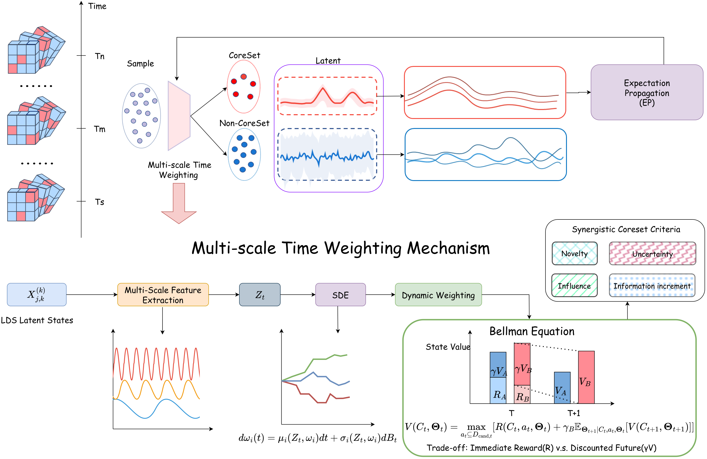
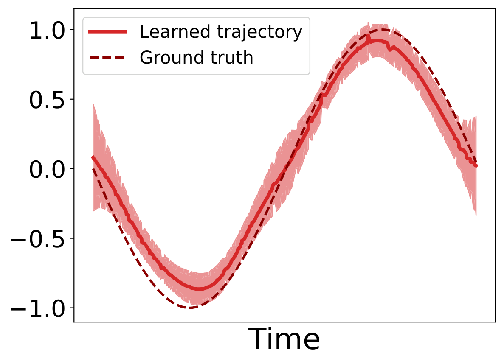
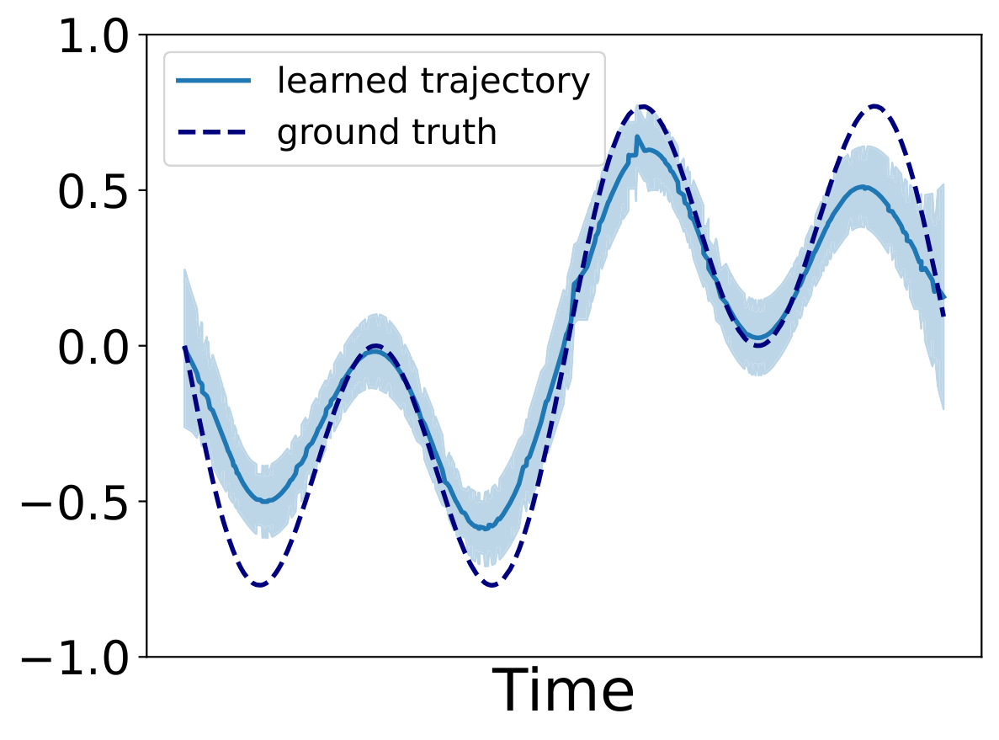
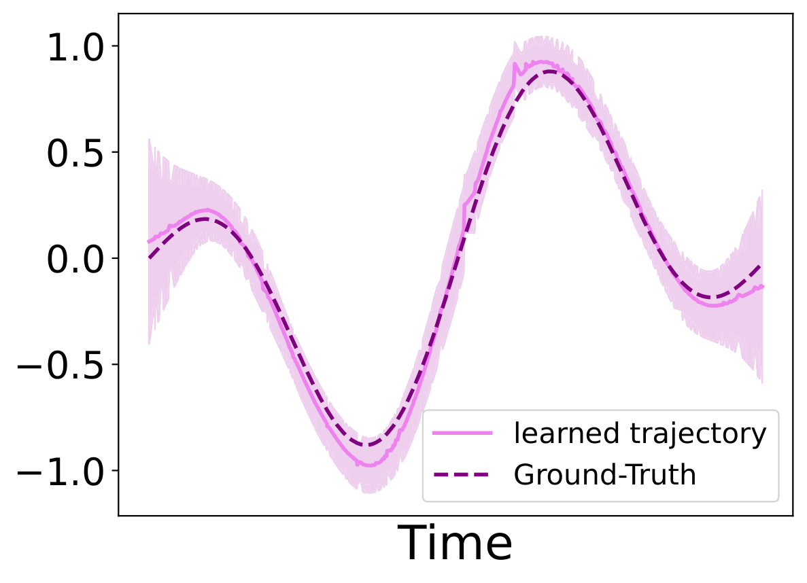
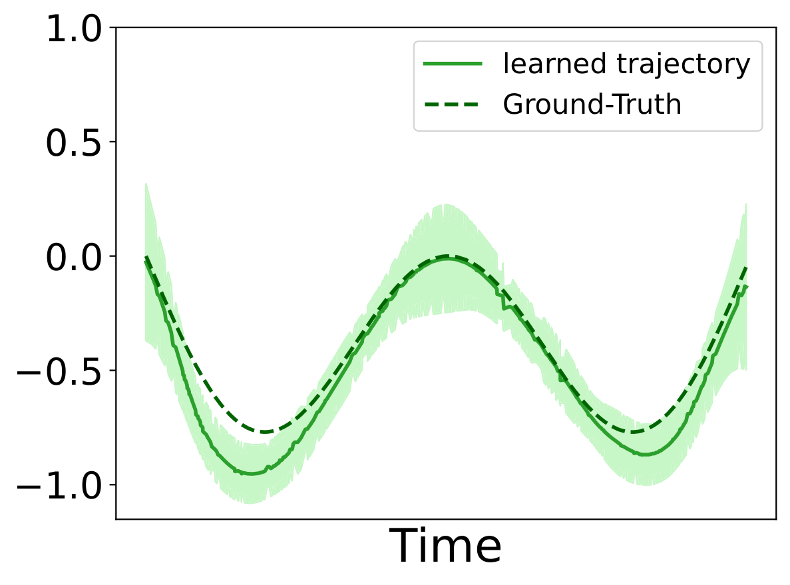
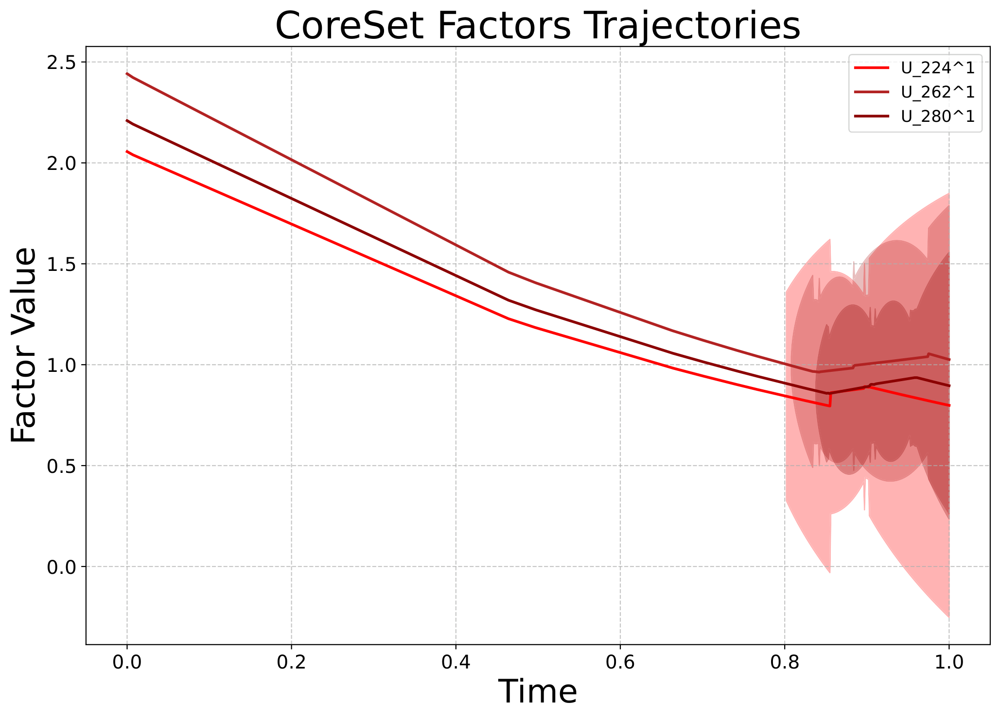
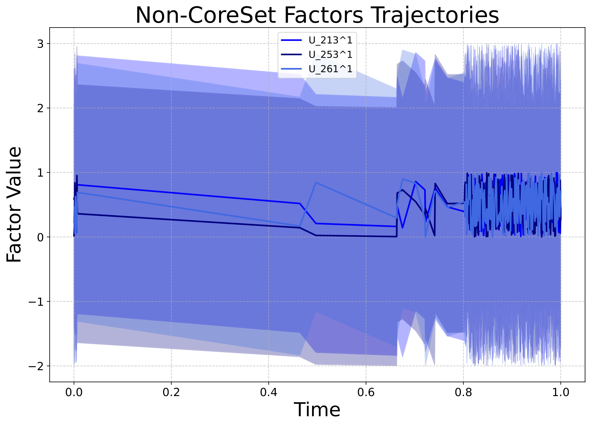
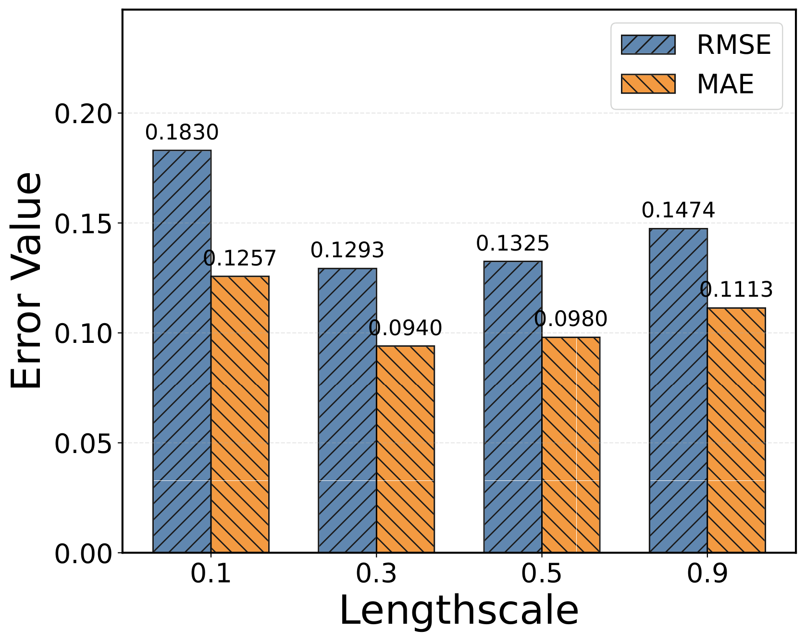
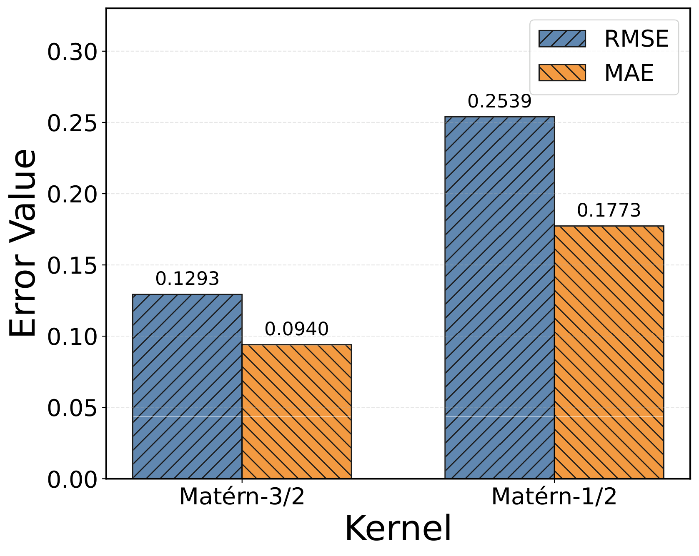
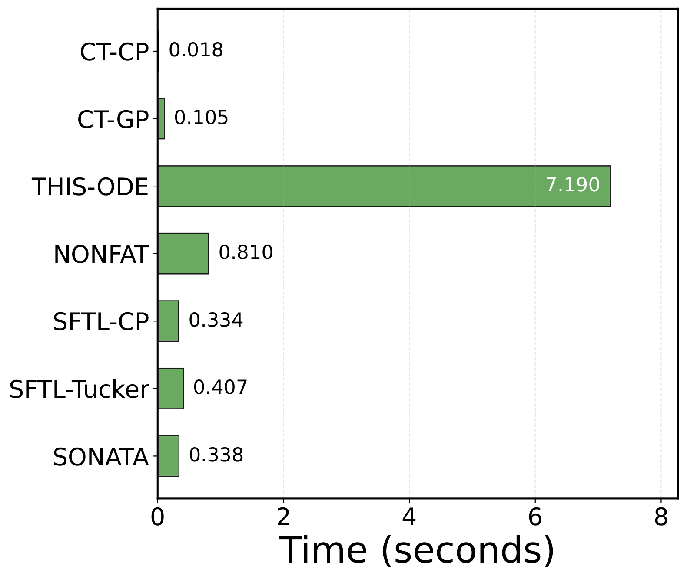

# ICLR 2026 | SONATA：让张量流分析既"看得准"又"跑得快"

今天跟大家分享一篇来自香港城市大学、浙江大学、复旦大学、上海期智研究院的论文，已被 **ICLR 2026** 接收！针对动态张量流分析中**建模表达能力不足**和**流数据效率低下**两大核心挑战，该工作提出了 **SONATA** 框架，将表达力丰富的动态嵌入建模与自适应 coreset 选择有机结合。SONATA 利用线性动态系统和时序核函数精细捕捉多尺度时间演化，同时通过 Bellman 方程启发的优化策略，动态从高速数据流中筛选最有价值的观测数据进行学习。相比现有方法，SONATA 在多个真实数据集上实现了显著提升，且无需依赖深度神经网络。

> **论文标题**：SONATA: Synergistic Coreset Informed Adaptive Temporal Tensor Factorization
> 
> **论文链接**：https://openreview.net/forum?id=P1PZBR6a4S
> 
> **代码**：https://github.com/Applied-Machine-Learning-Lab/ICLR2026_SONATA

   

---

## 核心问题

张量是表示多模态数据的强大工具，广泛应用于推荐系统、神经科学等领域。在现代场景中，这些张量往往以高速连续数据流的形式到达。从流数据中学习动态嵌入（Dynamic Embeddings）至关重要，但两个核心挑战长期存在：

1. **建模表达能力有限**：现有方法往往采用简化的时间假设（如离散时间分箱、线性插值），无法捕捉实体间复杂、非平稳的时间演化关系。
2. **流数据效率低下**：处理每个观测数据点在计算上代价高昂。现有方法要么无差别地处理所有数据，要么采用启发式采样，忽视了流数据中信息价值的高度不均匀性——大量样本是冗余的，而少数样本对提升表示质量和预测精度至关重要。

---

## 方法与框架

为了解决上述问题，我们提出了 **SONATA**（**S**ynergistic c**O**reset i**N**formed **A**daptive **T**emporal t**A**tor factorization），一个面向动态张量流的协同 coreset 自适应时间张量分解框架。SONATA 包含三大核心组件：

### 组件一：基于时序核函数的动态嵌入建模

SONATA 的核心是一个动态潜因子模型，每个实体的时间演化由**线性动态系统（LDS）**驱动。具体来说，实体 $j$ 在模式 $k$ 下的嵌入 $\mathbf{u}_j^{(k)}(t)$ 由潜在状态 $\mathbf{x}_j^{(k)}(t)$ 通过投影得到，潜在状态遵循随机微分方程（SDE）：

$$d\mathbf{x}_j^{(k)}(t) = \mathbf{F} \mathbf{x}_j^{(k)}(t) dt + \mathbf{L} d\mathbf{w}(t)$$

其中参数 $\mathbf{F}$、$\mathbf{H}$ 由时序核函数（如 Matérn-3/2）决定，使得模型能够捕捉**多尺度的时间动态**，同时保证嵌入轨迹的平滑性和连续性。

### 组件二：协同 Coreset 选择机制

**四维评估体系**：SONATA 为每个候选数据点计算综合重要性分数 $S_n$，综合考虑：

- **不确定性（Uncertainty）**：模型对相关实体嵌入的预测不确定度，优先选择模型"最不确定"的数据
- **影响力（Influence）**：候选数据与已有 coreset 成员的相似度，衡量其强化已知模式的潜力
- **新颖性（Novelty）**：候选数据包含新实体或新时间段的程度，发现新兴趋势
- **信息增量（Information Increment）**：基于 Martingale 机制估计的预测误差，量化"惊喜度"

$$S_n = w_u \cdot \mathcal{I}_{\text{unc}}(n) + w_i \cdot \mathcal{I}_{\text{inf}}(n) + w_n \cdot \mathcal{I}_{\text{nov}}(n) + w_m \cdot \mathcal{I}_{\text{mart}}(n)$$

**基于 Bellman 方程的时序 Coreset 演化**：coreset 的更新被建模为序列决策问题。通过 Bellman 方程优化选择策略，不仅考虑即时收益，更兼顾长期模型性能：

$$V(\mathcal{C}_t, \Theta_t) = \max_{a_t} \left[ \mathcal{R}(\mathcal{C}_t, a_t, \Theta_t) + \gamma \mathbb{E}[V(\mathcal{C}_{t+1}, \Theta_{t+1})] \right]$$

### 组件三：Coreset 引导的在线贝叶斯推断

利用 coreset 中浓缩的高质量信息，通过期望传播（Expectation Propagation）算法进行高效在线更新，**无需依赖深度神经网络**，即可实现自适应且准确的模型参数更新。

---

## 实验与结果

### 1. 主要实验结果

我们在四个真实世界数据集上进行了全面评估：**CA Traffic 30K**（交通流量）、**ServerRoom**（服务器监控）、**BeijingAir**（空气质量）、**FitRecord**（用户行为），与 14 种基线方法（包括静态方法和流式方法）进行对比。

SONATA 在所有数据集上均取得最佳性能。在 CA Traffic 30K 上，RMSE 达到 **0.089**，相比第二名 SFTL-CP（0.231）降低了 **61.5%**（$p < 0.05$），展示了在捕捉复杂时空模式（如交通拥堵演化）方面的卓越能力。

| 数据集 | SONATA (RMSE) | 第二名 (RMSE) | 提升 |
|--------|--------------|--------------|------|
| CA Traffic 30K | **0.089** | 0.231 (SFTL-CP) | 61.5% |
| ServerRoom | **0.115** | 0.117 (NONFAT) | 1.7% |
| BeijingAir | **0.237** | 0.248 (SFTL-CP) | 4.4% |
| FitRecord | **0.414** | 0.424 (SFTL-CP) | 2.4% |

### 2. Coreset 有效性分析

如下图所示，**coreset 因子**展现出更结构化、更一致的行为模式和更清晰的轨迹，而**非 coreset 因子**则呈现更不规则、更嘈杂的轨迹。这验证了 SONATA 能够有效识别并选择最具信息量的数据。

### 3. 参数敏感性分析

**时间长度尺度（Lengthscale）效应**：在 Server 数据集上，lengthscale=0.3 时取得最低误差（RMSE=0.129）。过小导致过拟合噪声，过大则过度平滑重要时间模式。

**核函数选择**：Matérn-3/2 核相比 Matérn-1/2，RMSE 降低 **49.1%**，MAE 降低 **47.0%**，证明中等平滑度更适合时空张量数据。

### 4. 计算效率

SONATA 每次迭代仅需 **0.338 秒**，远低于基于深度神经网络的 THIS-ODE（7.190 秒），同时保持最高精度。这体现了"无需深度网络，也能又准又快"的设计理念。

### 5. Coreset 预算分析

实验表明 SONATA 不会盲目填满预算，而是自动收敛到最优 coreset 大小。当预算从 2000 增至 3000 时，实际使用量仅从 1597 微增至 1654，利用率从 79.9% 降至 55.1%，RMSE 仅改善 5%。这说明约 **1600 个高质量样本**就足以捕获数据流的关键信息。

---

## 贡献总结

1. **统一框架**：首次将动态嵌入建模与协同 coreset 构建有机结合，同时解决张量流分析中的表达能力和效率问题。
2. **协同选择机制**：提出基于不确定性、影响力、新颖性和信息增量四维评估的 coreset 选择策略，并通过 Bellman 方程优化长期效用。
3. **高效推断**：开发基于 coreset 引导的在线贝叶斯推断算法，无需深度神经网络即可实现自适应更新。
4. **卓越性能**：在多个真实数据集上显著超越现有 SOTA 方法，且计算效率具有竞争力。

---

## 团队信息

- **通讯作者**：Xiangyu Zhao（香港城市大学）、Zenglin Xu（复旦大学）
- **第一作者**：王茂林（香港城市大学）
- **合作单位**：香港城市大学、浙江大学、复旦大学、上海期智研究院

---

如果你喜欢这篇文章，欢迎「**点赞+收藏+关注**」！
如果你有任何想法，欢迎留言交流。
